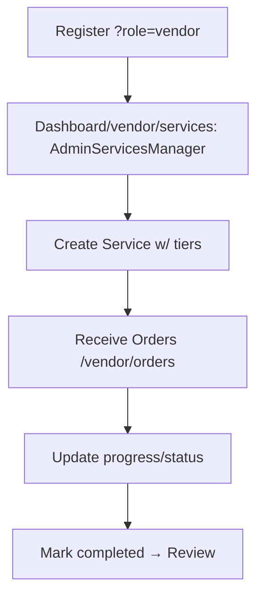

# 🏗️ Octupus Freelance Marketplace - Architecture Overview

For Product Designer review. Generated from repo analysis.

## 📊 High-Level Layers

```
┌─────────────────┐    ┌──────────────────┐    ┌─────────────────┐
│   Next.js 14    │◄──►│   API Routes     │◄──►│   MongoDB       │
│ App Router      │    │ (app/api/)       │    │ (Mongoose)      │
│                 │    │ services/cart/   │    │ Models: User/   │
│ ┌─Pages         │    │ orders/payments  │    │ Service/Order/  │
│ │ layout.tsx    │    │ admin/users/...  │    │ Cart/Fav/Review │
│ │ page.tsx(hero)│    │ auth/register    │    └─────────────────┘
│ └─dashboard/    │    └──────────────────┘           ▲
│   buyer/vendor/ │               ▲                  │
│   admin/tables  │               │                  │
└─────────────────┘               │             Stripe Webhook
         ▲                        │                  │ Checkout
┌─────────────────┐               │             ┌──────────────┐
│ Components/UI   │◄───────────────┘             │ External     │
│ Navbar/CartBtn  │                              │ Stripe/API   │
│ ServiceCard/    │                    ┌──────────┴──────────────┤
│ DashboardSidebar│                    │ NextAuth (Google)     │
│ OrdersManager   │                    └────────────────────────┘
└─────────────────┘
```

## 🗂️ Folder Structure Tree

```
New-test-repo-/
├── app/
│   ├── (marketplace)/services/[id]/page.tsx
│   ├── cart/page.tsx
│   ├── checkout/page.tsx  
│   ├── dashboard/
│   │   ├── admin/{users/orders/services/reviews/analytics}/page.tsx
│   │   ├── buyer/{orders/favorites/settings}/page.tsx
│   │   └── vendor/{services/orders/settings/earnings/purchases}/page.tsx
│   ├── layout.tsx (SessionProvider)
│   └── page.tsx (Landing: hero/categories/featured/latest)
├── components/
│   ├── layout/Navbar.tsx CartButton.tsx
│   ├── marketplace/ServiceCard.tsx ServiceDetailClient.tsx
│   ├── dashboard/{admin|buyer|shared}/tables/managers/sidebar/navConfigs.ts
│   ├── cart/CheckoutButton.tsx RemoveCartItemButton.tsx
│   └── ui/Button.tsx
├── lib/ {db.ts auth.ts stripe.ts api-helpers.ts}
├── models/ {User.ts Service.ts Order.ts Cart.ts Favorite.ts Review.ts}
├── app/api/ {services/cart/favorites/orders/reviews/payments/checkout/webhook/admin/users/[id]/{ban/suspend/restore/password}/route.ts}
├── styles/ {globals.css + modular css}
├── package.json (Next14/NextAuth/Mongoose/Stripe)
└── Readme.md
```

## 🔄 User Flows (Mermaid)

### Buyer Flow
```mermaid
flowchart TD
    A[Landing /services ?category=q] --> B[ServiceDetail: tiers/reviews]
    B --> C[Add to Cart]
    C --> D[/cart: CheckoutButton]
    D --> E[Stripe Checkout /api/payments/checkout]
    E --> F[Webhook → Order pending/paid]
    F --> G[Dashboard/buyer/orders: OrdersManager]
    G --> H[Mark progress/delivered/completed]
```

### Vendor Flow


### Admin Flow
```mermaid
flowchart TD
    O[Login admin] --> P[Dashboard/admin/users: table ban/suspend/restore]
    P --> Q[Admin/services|orders|reviews/analytics]
```

## 📋 Key Pages & APIs

| Type | Path/Endpoint | Description |
|------|---------------|-------------|
| **Landing** | `/` | Hero, categories, featured/latest services |
| **Marketplace** | `/services?category=q=featured=` `/services/[id]` | List/detail w/ ServiceCard |
| **Cart/Checkout** | `/cart` `/checkout` `/api/cart` `/api/payments/checkout` | Multi-item → Stripe |
| **Dashboard Buyer** | `/dashboard/buyer/{orders/favorites/settings}` | BuyerOrdersList, FavoritesClient |
| **Dashboard Vendor** | `/dashboard/vendor/{services/orders}` | OrdersManager, services mgmt |
| **Dashboard Admin** | `/dashboard/admin/{users/services/orders}` | Tables: AdminUsersTable/ServicesTable etc. |
| **Auth** | `/api/auth/[...nextauth]` `/register` | Credentials/Google + hCaptcha |

## 🛠️ Tech Decisions
- **Server Components** + App Router for perf/SEO.
- **MongoDB** full-text search on services.
- **NextAuth JWT** w/ role/status callbacks.
- **Stripe** Checkout + webhook for orders.
- **Custom CSS** modular files.

Ready for production (Vercel + Atlas + Stripe live keys).
